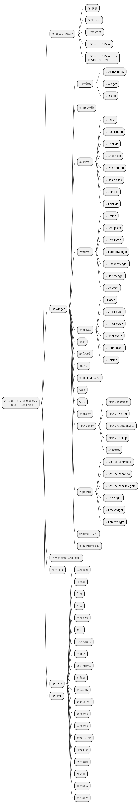

# Qt 企业级应用开发系统学习路线
作者：凶猛的瘦子

## Qt 介绍

Qt是一个跨平台的C++图形用户界面应用程序开发框架，最初由挪威的Trolltech公司开发，后来被诺基亚收购，现在由Qt公司维护。它提供了丰富的工具和类库，使开发者能够轻松地创建各种类型的应用程序，包括桌面应用、移动应用、嵌入式应用和即时通讯软件等。

Qt官网：https://www.qt.io/

## Qt 特点
- 跨平台性： Qt的应用程序可以轻松地在各种操作系统上运行，包括Windows、macOS、Linux、iOS和Android等。
- 丰富的类库： Qt提供了大量的类库，涵盖了从图形界面到网络编程等各种功能，开发者可以利用这些类库来快速构建应用程序。
- 信号与槽机制： Qt引入了信号与槽机制，这是一种非常灵活的事件处理方式，能够简化程序的逻辑设计。
- 良好的文档和社区支持： Qt拥有完善的文档和活跃的社区支持，开发者可以轻松地获取到相关的教程、示例代码和帮助文档。
- 可视化设计工具： Qt提供了Qt Creator等可视化的集成开发环境，方便开发者进行界面设计和代码编写。

Qt被广泛应用于各种领域，包括桌面应用程序、移动应用程序、游戏开发、工业控制、医疗设备、汽车电子等，是一个非常强大且灵活的开发框架。

## 使用 Qt 开发的知名商业项目
- VirtualBox： 一款开源的虚拟化软件，使用Qt作为其图形用户界面工具包。
- Autodesk Maya： 一款专业的3D建模、动画和渲染软件，部分使用了Qt进行界面开发。
- Google Earth： 这款虚拟地球软件的桌面版本（Google Earth Pro）使用了Qt作为其图形用户界面工具包。
- MATLAB： 数值计算软件MATLAB的桌面版本中，使用了Qt作为其图形用户界面工具包。
- KDE桌面环境： KDE是一个开源的桌面环境，包括一系列的应用程序和工具，其中很多应用程序使用了Qt进行开发。
- Wireshark： 开源的网络协议分析工具，使用了Qt进行界面开发。
- RStudio： 一款专业的用于R语言编程的集成开发环境（IDE），使用Qt进行界面设计。
- Qt Creator： Qt自己的集成开发环境，完全基于Qt开发。
- WPS、腾讯会议、优酷、YY语音、剪映、万兴喵影、亿图脑图、福昕软件等等。

## 使用 Qt 开发的开源项目
- VLC media player： 开源的跨平台多媒体播放器，使用Qt进行界面设计，可以播放绝大部分格式文件，以及 rtmp，rtsp 推拉流。
- OBS Studio： 开源的跨平台直播流和录制软件，用于创建高质量的实时视频和音频内容，提供一种简单而功能强大的工具，使用户能够轻松地进行直播流媒体和录制视频。
- Shotcut：开源的跨平台视频编辑软件，易于使用但功能强大的视频编辑工具，适用于各种用户，包括初学者和专业用户。

## Qt 学习大纲
- **Qt 开发环境搭建**
掌握使用 QtCreator、VS2022、VSCode 进行 Qt 开发
- **Qt Widget**
掌握使用 Qt Widget 实现用户界面开发技能
- **仿网易云音乐界面项目**
Qt Widget 总结项目，达到 Qt 初级开发水平
- **程序打包**
掌握程序打包流程
- **Qt Core**
Qt 进阶部分相关模块学习，Qt 元对象系统学习，达到 Qt 中级开发水平
- **Qt QML**
掌握使用 Qt QML 实现用户界面开发

## Qt 学习目标
- 零基础快速入门 Qt Widget 框架，掌握开发工具使用，掌握 Qt Widget 常用控件和界面布局用法，仿网易云音乐界面项目实战达到企业招聘 Qt 初级开发要求
- 掌握 Qt 进阶部分开发技能，达到企业招聘 Qt 中级开发要求
- 掌握 QML 界面开发技能，很多企业要求掌握 QML

## Qt 学习路线思维导图

