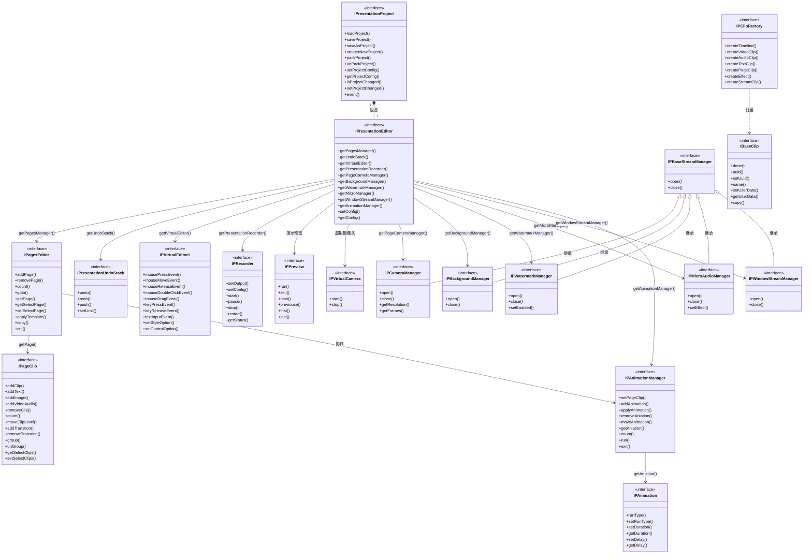
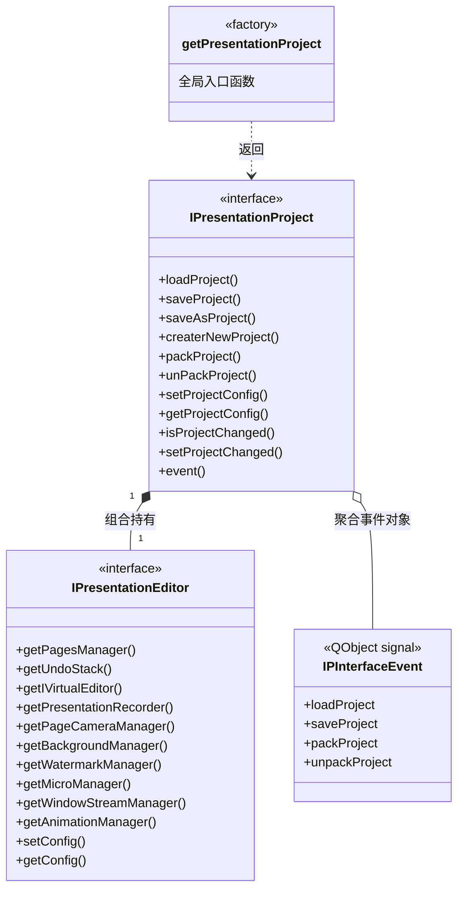
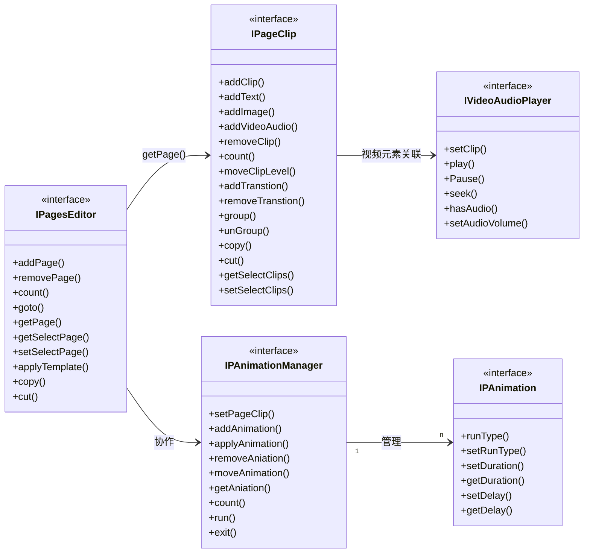
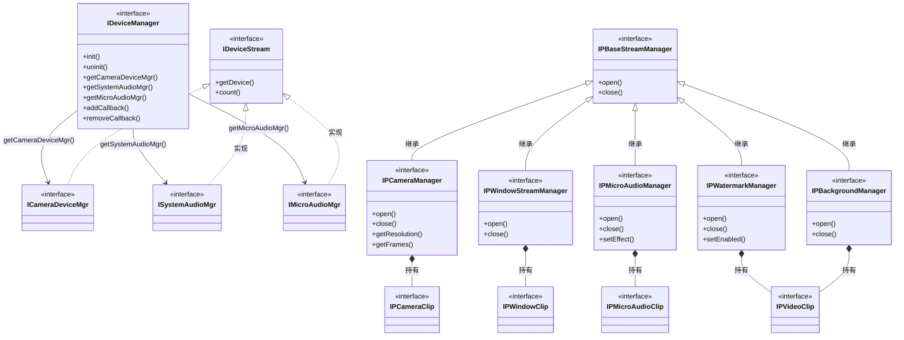
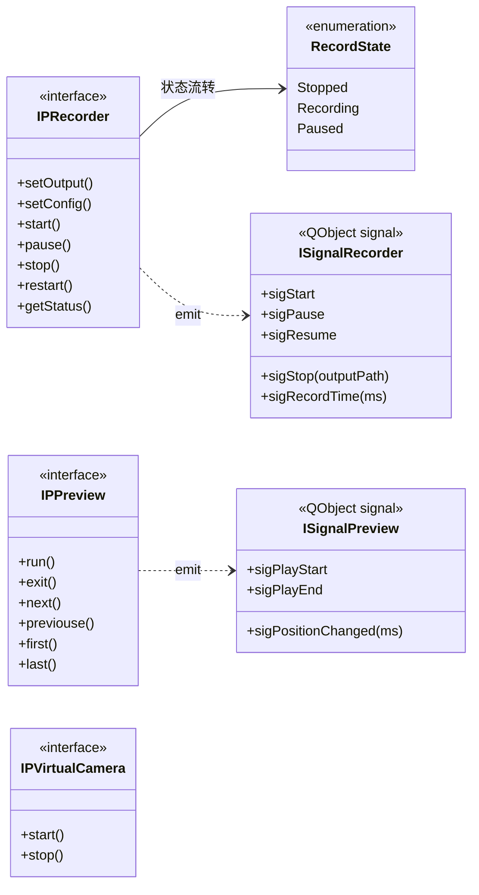
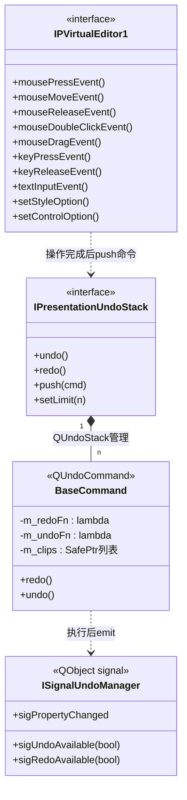
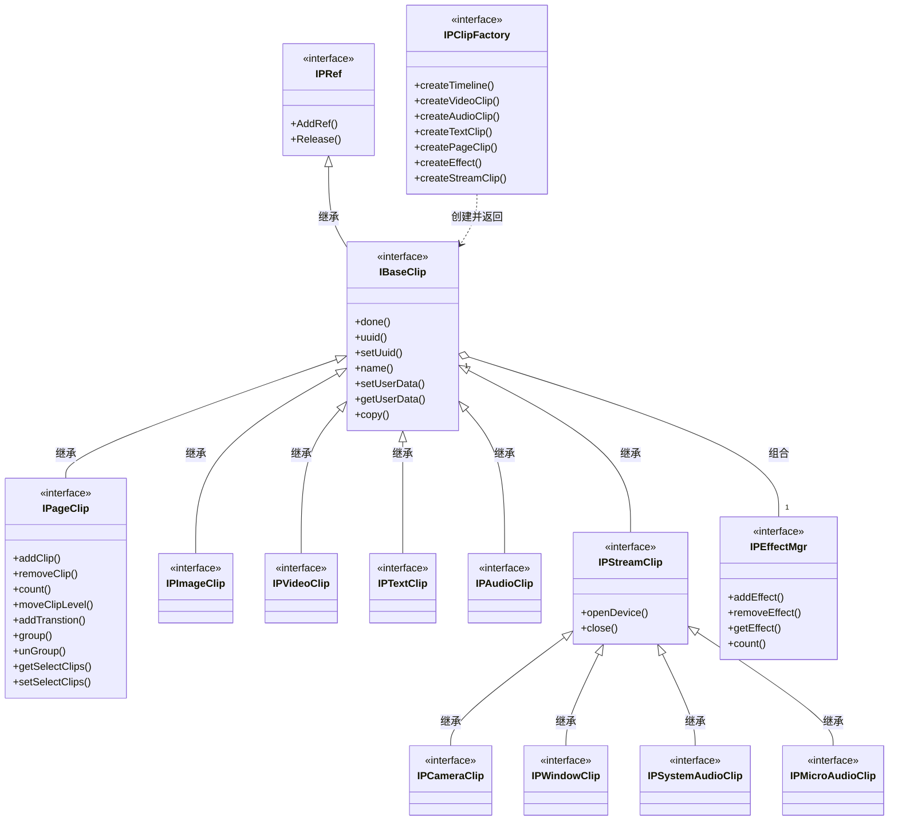
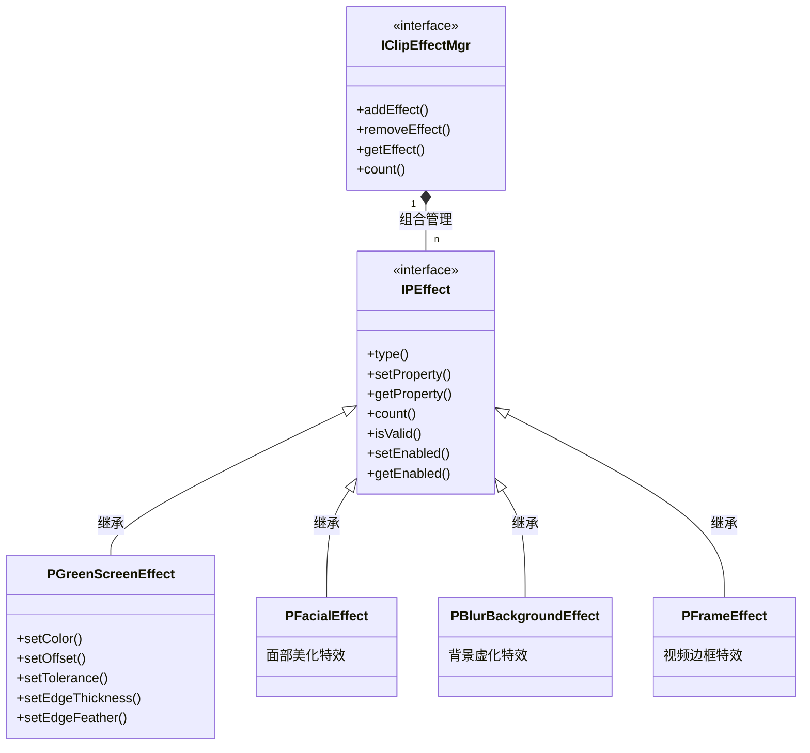

pbl_interface_design.md
# PBL 接口设计文档

> PBL（Presentation Business Layer）是 Presentory 演示功能的核心中间层，负责将上层 Qt UI 与下层 WES/tlb 渲染引擎完全解耦，通过纯虚接口体系承担项目管理、页面/Clip 生命周期、设备管理、预览录制控制、Undo/Redo、动画等全套业务逻辑。

---

## 一、整体架构分层

```
┌─────────────────────────────────────────────────────────┐
│                      UI 层                               │
│   主界面 / 页面面板 / 属性面板 / 编辑预览区 / AI 辅助模块   │
└───────────────────────┬─────────────────────────────────┘
                        │ 纯虚接口（I*.h）+ 信号事件
┌───────────────────────▼─────────────────────────────────┐
│                    PBL 业务层                             │
│  ┌────────────┐ ┌────────────┐ ┌────────────┐           │
│  │ Project 编辑│ │ Page 编辑  │ │ 动画编辑   │           │
│  └────────────┘ └────────────┘ └────────────┘           │
│  ┌────────────┐ ┌────────────┐ ┌────────────┐           │
│  │ 时实流编辑  │ │ 可视化编辑  │ │ 演示操作   │           │
│  └────────────┘ └────────────┘ └────────────┘           │
├─────────────────────────────────────────────────────────┤
│                    PBL 封装层                             │
│  Timeline / Resource / Clip / 属性设置 / 自定义数据 / 可视化       │
└───────────────────────┬─────────────────────────────────┘
                        │ WESManager 适配层
┌───────────────────────▼─────────────────────────────────┐
│               WES / tlb 渲染引擎（C++ native）            │
│   ITlbClipFactory / ITlbEditing / ITlbPreview           │
└─────────────────────────────────────────────────────────┘
```

**核心原则**：UI 层只依赖 `Include/` 下的纯虚接口头文件，不 include 任何 PBL 实现文件；所有跨模块事件通过 `ISignal*` 单例信号总线（Qt Signal/Slot）广播，实现依赖倒置。

---

## 二、接口总结构 UML



---

## 三、时间轴结构设计

PBL 的时间轴（Timeline）是整个演示项目的数据骨架，以多轨道方式组织所有内容：

```
Pages（顶层容器）
  └── Timeline（主时间轴）
        ├── BackgroundClip    // 背景（颜色/图片/视频）
        ├── CameraClip        // 摄像头画面
        ├── WatermarkClip     // 水印
        ├── WindowClip        // 屏幕/窗口捕获
        ├── SystemAudioClip   // 系统音频
        ├── PageClip 1        // 第 1 页
        │     ├── 动画列表
        │     ├── 转场 Clip
        │     └── 子 Clip 若干（文字/图片/视频等）
        ├── PageClip 2        // 第 2 页
        └── PageClip N        // 第 N 页
```

**PageClip 核心能力**：
- 管理子 Clip 的增加、删除、移动层级
- 持有转场效果（TransClip）及页面切换动效
- 支持 Next/Pre 步操作（动画步骤控制）
- 内含动画列表，管理元素的进场/出场/强调动画

**时间轴特性**：Presentory 的各页面在时间轴上按顺序串行排列（非并行叠加），换页即跳转到对应 PageClip 的起始时间点；页面重排通过调整轨道顺序实现，不创建新对象。

---

## 四、六大核心模块

| 模块 | 负责接口 | 核心职责 |
|------|---------|---------|
| **工程管理** | `IPresentationProject` | 项目文件加载/保存/另存/新建/打包，项目变更状态管理 |
| **页管理** | `IPagesEditor` + `IPageClip` | 页面 CRUD、层级操作、动画管理、转场设置 |
| **时实流管理** | `IPBaseStreamManager` 及子类 | 摄像头/麦克风/水印/背景/窗口捕获流的开启与关闭 |
| **预览控制** | `IPPreview` + `IPRecorder` | 演示预览播放控制；录制的开始/暂停/停止 |
| **可视化管理** | `IPVirtualEditor1` | 鼠标/键盘事件代理，画布上的交互编辑操作 |
| **动画管理** | `IPAnimationManager` + `IPAnimation` | 动画的添加/应用/移除/排序，动画属性配置 |

---

## 五、接口详细设计

### 5.1 工程管理接口

```
<<signal>> getPresentationProject
      │
      ▼
IPresentationProject
  +loadProject()          // 加载工程文件，反序列化重建所有 Clip
  +saveProject()          // 保存工程文件
  +saveAsProject()        // 另存为
  +createrNewProject()    // 新建空项目
  +packProject()          // 打包工程（含媒体资源）
  +unPackProject()        // 解包工程
  +setProjectConfig()     // 设置工程配置（分辨率/帧率等）
  +getProjectConfig()     // 读取工程配置
  +isProjectChanged()     // 项目是否有未保存修改
  +setProjectChanged()    // 标记项目修改状态
  +event()                // 接收工程事件回调
      │ 组合
      ▼
IPresentationEditor       // 核心编辑器，聚合所有子 Manager
  +getPagesManager()      // 获取页面管理器
  +getUndoStack()         // 获取撤销栈
  +getIVirtualEditor()    // 获取可视化编辑器
  +getPresentationRecorder() // 获取录制器
  +getPageCameraManager() // 获取摄像头管理器
  +setConfig()            // 设置编辑器配置
  +getConfig()            // 读取编辑器配置
```

**架构说明**：`IPresentationProject` 是整个系统的入口，通过全局信号函数 `getPresentationProject()` 获取。它组合持有 `IPresentationEditor`，后者再作为门面暴露各子 Manager，UI 层只需持有 `IPresentationProject` 一个引用即可访问全部功能。



---

### 5.2 页面管理接口

```
IPagesEditor                        IPAnimationManager
  +addPage()                          +setPageClip()      // 设置当前操作的 PageClip
  +removePage()                       +addAnimation()     // 添加动画
  +count()                            +applyAnimation()   // 应用动画
  +goto()                             +removeAniation()   // 删除动画
  +getPage()       ──────────────►    +moveAnimation()    // 调整动画顺序
  +getSelectPage()                    +getAniation()      // 获取动画对象
  +setSelectPage()                    +count()            // 动画数量
  +applyTemplate() 应用模板            +run()              // 预览动画
  +copy()                             +exit()             // 退出动画预览
  +cut()                                   │
                                           ▼
IPageClip                           IPAnimation
  +addClip()                          +runType()          // 动画运行类型（进场/出场/强调）
  +addText()                          +setRunType()
  +addImage()                         +setDuration()      // 动画持续时间
  +addVideoAudio()                    +getDuration()
  +removeClip()                       +setDelay()         // 动画延迟
  +count()                            +getDelay()
  +moveClipLevel()    // 调整层级（上移/下移/置顶/置底）
  +addTranstion()     // 添加转场
  +removeTranstion()  // 移除转场
  +group()            // 元素编组
  +unGroup()          // 取消编组
  +copy()
  +cut()
  +getSelectClips()   // 获取当前选中的 Clip 列表
  +setSelectClips()
```

**设计说明**：`IPagesEditor` 管理页面集合，`IPageClip` 管理单个页面内的元素。动画管理器（`IPAnimationManager`）与页面编辑器协作，通过 `setPageClip()` 切换操作目标，实现动画与页面的解耦。



---

### 5.3 设备管理与流管理接口

```
设备层（IDeviceManager）
  IDeviceManager
    +init()
    +uninit()
    +getCameraDeviceMgr()     → ICameraDeviceMgr（摄像头设备枚举）
    +getSystemAudioMgr()      → ISystemAudioMgr（系统音频设备枚举）
    +getMicroAudioMgr()       → IMicroAudioMgr（麦克风设备枚举）
    +addCallback()            // 注册设备变更回调
    +removeCallback()

  IDeviceStream               // 设备流通用接口
    +getDevice()              // 获取指定设备
    +count()                  // 设备数量

流管理层（IPBaseStreamManager 继承体系）
  IPBaseStreamManager
    +open()
    +close()
      ├── IPCameraManager     // 摄像头流
      │     +getResolution()  // 获取摄像头分辨率
      │     +getFrames()      // 获取帧率
      │     └── → IPCameraClip
      ├── IPWindowStreamManager  // 屏幕/窗口捕获流
      │     └── → IPWindowClip
      ├── IPMicroAudioManager    // 麦克风音频流
      │     +setEffect()         // 设置降噪/混响等效果
      │     └── → IPMicroAudioClip
      ├── IPWatermarkManager     // 水印流
      │     +setEnabled()        // 水印开关
      │     └── → IPVideoClip
      └── IPBackgroundManager    // 背景流
            └── → IPVideoClip
```

**设计说明**：设备层负责设备枚举与热插拔监听，流管理层负责各类媒体流的生命周期管理（open/close）。两层通过 `IDeviceStream` 桥接，各流管理器持有对应的 Clip 对象，Clip 承载实际的渲染数据。



---

### 5.4 预览与录制接口

```
IPRecorder（录制器）           IPPreview（演示预览）
  +setOutput()  设置输出路径      +run()      开始演示预览
  +setConfig()  设置录制配置      +exit()     退出演示
  +start()      开始录制          +next()     下一步/页
  +pause()      暂停录制          +previouse() 上一步/页
  +stop()       停止录制          +first()    跳至第一页
  +restart()    重新录制          +last()     跳至最后一页
  +getStatus()  获取录制状态

IPVirtualCamera（虚拟摄像头）
  +start()      启动虚拟摄像头输出
  +stop()       停止虚拟摄像头
```

**录制状态机**：`Stopped → Recording → Paused → Recording → Stopped`

**预览说明**：`IPPreview` 控制演示模式下的页面导航，支持逐步/逐页翻转；录制（`IPRecorder`）与推流共享底层引擎，录制输出到本地文件，推流输出到 RTMP 等直播协议。



---

### 5.5 撤销栈与可视化编辑接口

```
IPresentationUndoStack（撤销栈）
  +undo()       执行撤销
  +redo()       执行重做
  +push()       压入操作命令
  +setLimit()   设置历史记录上限

IPVirtualEditor1（画布交互代理）
  +mousePressEvent()         // 鼠标按下
  +mouseMoveEvent()          // 鼠标移动
  +mouseReleaseEvent()       // 鼠标抬起
  +mouseDoubleClickEvent()   // 双击（进入文本编辑等）
  +mouseDragEvent()          // 拖拽（移动/拉伸元素）
  +keyPressEvent()           // 键盘按下
  +keyReleaseEvent()         // 键盘抬起
  +textInputEvent()          // 文本输入事件
  +setStyleOption()          // 设置元素样式（字体/颜色/描边等）
  +setControlOption()        // 设置控件选项
```

**设计说明**：`IPVirtualEditor1` 将 Qt 的底层鼠标/键盘事件转发给 WES 引擎处理，引擎负责命中测试、元素拾取和变换计算；PBL 层不直接操作 Qt 控件坐标，保持 UI 与渲染逻辑解耦。



---

### 5.6 Clip 类型体系

```
IPRef（根接口，引用计数基类）
  └── IBaseClip（基础 Clip 接口）
        +done()             // 完成/释放
        +uuid()             // 唯一标识
        +setUuid()
        +name()             // Clip 名称
        +setUserData()      // 自定义扩展数据（键值对）
        +getUserData()
        +copy()             // 复制 Clip
              │
              ├── IPageClip       // 页面容器 Clip（含多轨道）
              ├── IPImageClip     // 图片 Clip
              ├── IPVideoClip     // 视频 Clip（含音频）
              ├── IPTextClip      // 文字 Clip
              ├── IPAudioClip     // 纯音频 Clip
              └── IPStreamClip   // 采集流基类
                    +openDevice()
                    +close()
                          ├── IPCameraClip      // 摄像头采集
                          ├── IPWindowClip      // 屏幕/窗口采集
                          ├── IPSystemAudioClip // 系统音频采集
                          └── IPMicroAudioClip  // 麦克风采集

独立接口：
  IPClipFactory（Clip 工厂）
    +createTimeline()     // 创建子时间轴
    +createVideoClip()    // 创建视频 Clip
    +createAudioClip()    // 创建音频 Clip
    +createTextClip()     // 创建文字 Clip
    +createPageClip()     // 创建页面 Clip
    +createEffect()       // 创建特效 Clip
    +createStreamClip()   // 创建采集流 Clip

  IPEffectMgr（特效管理器，组合挂在 IBaseClip 上）
    +addEffect()
    +removeEffect()
    +getEffect()
    +count()
```

**设计说明**：`IPRef` 提供引用计数基础；`IBaseClip` 定义所有 Clip 共同的身份（uuid）和扩展数据接口；业务 Clip 类型继承 `IBaseClip` 并扩展各自特有接口。`IPClipFactory` 封装所有 Clip 的创建逻辑，UI 层无需了解 tlb 底层创建细节。



---

### 5.7 特效接口体系

```
IClipEffectMgr（Clip 特效管理器）
  +addEffect()
  +removeEffect()
  +getEffect()
  +count()
      │ 组合
      ▼
  IPEffect（特效基础接口）
    +type()           // 特效类型枚举
    +setProperty()    // 设置特效参数
    +getProperty()    // 读取特效参数
    +count()          // 参数项数量
    +isValid()        // 特效是否有效
    +setEnabled()     // 特效开关
    +getEnabled()
          │
          ├── PGreenScreenEffect（绿幕抠图特效）
          │     +setColor()          // 抠除颜色
          │     +setOffset()         // 颜色偏移容差
          │     +setTolerance()      // 抠图容差
          │     +setEdgeThickness()  // 边缘厚度
          │     +setEdgeFeather()    // 边缘羽化
          ├── PFacialEffect          // 面部美化特效
          ├── PBlurBackgroundEffect  // 背景虚化特效
          └── PFrameEffect           // 视频边框特效
```

**设计说明**：特效系统采用组合方式挂载在 Clip 上（`IClipEffectMgr` 由 `IBaseClip` 持有），而非继承。每种特效类型继承 `IPEffect` 并扩展自身参数接口，新增特效类型不需修改基类，符合开闭原则。



---

### 5.8 事件与回调机制

PBL 提供两种异步通知模式，分别适用于不同场景：

```
方案 A：Qt 信号/事件模式（推荐）
  QObject
    └── IPInterfaceEvent（Qt 信号对象）
          +loadProject     // emit：工程加载完成
          +saveProject     // emit：工程保存完成
          +packProject     // emit：工程打包完成
          +unpackProject   // emit：工程解包完成

  IPInterface
    +event()              // 连接到 IPInterfaceEvent
    └── 持有 IPInterfaceEvent（聚合）

方案 B：传统回调函数模式
  IPInterface1
    +addLoadProjectCallback()   // 注册加载完成回调
    +addSaveProjectCallback()   // 注册保存完成回调
    └── 持有 callback（聚合）
```

**选型说明**：方案 A（Qt 信号）适合 UI 层订阅——利用 `QObject` 的自动断连机制安全管理生命周期，支持跨线程信号（`QueuedConnection`）；方案 B（回调）适合非 Qt 模块（如纯 C++ 工具类）订阅。PBL 实际实现中以 `ISignal*` 单例信号总线为主（属于方案 A 的演进版），七大信号类覆盖全部核心业务事件。

```mermaid
classDiagram
    direction LR

    class QObject {
        Qt基类
    }

    class IPInterfaceEvent {
        <<QObject signal>>
        +loadProject
        +saveProject
        +packProject
        +unpackProject
    }

    class IPInterface {
        <<interface>>
        方案A Qt信号模式
        +event()
    }

    class IPInterface1 {
        <<interface>>
        方案B 传统回调模式
        +addLoadProjectCallback()
        +addSaveProjectCallback()
    }

    class callback {
        回调函数对象
    }

    QObject <|-- IPInterfaceEvent : 继承
    IPInterface o-- IPInterfaceEvent : 聚合持有
    IPInterface1 o-- callback : 聚合持有
```

---

## 六、ISignal* 信号总线全览

| 信号类 | 主要信号 | 触发时机 |
|--------|---------|---------|
| `ISignalProject` | `sigProjectSwitched` / `sigProjectChanged` / `sigProjectLoadFinished` / `sigAIGCApplyFinished` | 工程 IO 完成、AI 模板应用完成 |
| `ISignalPage` | `sigPageAdded` / `sigPageRemoved` / `sigPageMoved` / `sigPageThumbnail` / `sigCurrentPageChanged` | 页面集合变更、缩略图更新就绪 |
| `ISignalDevice` | `sigDeviceAdded` / `sigDeviceRemoved` / `sigDeviceStateChanged` | 摄像头/麦克风热插拔 |
| `ISignalPreview` | `sigPlayEnd` / `sigPlayStart` / `sigPositionChanged` | 预览播放进度变化（高频） |
| `ISignalRecorder` | `sigStart` / `sigStop` / `sigPause` / `sigRecordTime` | 录制状态变化、计时回调 |
| `ISignalUndoManager` | `sigUndoAvailable` / `sigRedoAvailable` / `sigPropertyChanged` | Undo/Redo 可用状态变化 |
| `ISignalClipBoard` | `sigClipBoardChanged` / `sigCanPaste` | 剪贴板内容变化 |

**使用规范**：UI 各模块只 `connect` 这些信号，不 `include` 任何 PBL 实现头文件；PBL 内部子模块之间同样通过 `ISignal*` 通信，实现模块内/外一致的依赖倒置。

```mermaid
classDiagram
    direction TB

    class ISignalProject {
        <<QObject singleton>>
        +sigNewProject
        +sigProjectSwitched
        +sigProjectChanged
        +sigProjectLoadFinished
        +sigProjectSaveFinished
        +sigAIGCApplyFinished
    }

    class ISignalPage {
        <<QObject singleton>>
        +sigPageAdded(index)
        +sigPageRemoved(index)
        +sigPageMoved(from, to)
        +sigPageThumbnail(index, image)
        +sigCurrentPageChanged(index)
        +sigPageClipsChanged
    }

    class ISignalDevice {
        <<QObject singleton>>
        +sigDeviceAdded(id)
        +sigDeviceRemoved(id)
        +sigDeviceStateChanged(id, state)
    }

    class ISignalPreview {
        <<QObject singleton>>
        +sigPlayStart
        +sigPlayEnd
        +sigPositionChanged(ms)
    }

    class ISignalRecorder {
        <<QObject singleton>>
        +sigStart
        +sigStop(path)
        +sigPause
        +sigResume
        +sigRecordTime(ms)
    }

    class ISignalUndoManager {
        <<QObject singleton>>
        +sigUndoAvailable(bool)
        +sigRedoAvailable(bool)
        +sigPropertyChanged
    }

    class ISignalClipBoard {
        <<QObject singleton>>
        +sigClipBoardChanged
        +sigCanPaste(bool)
    }
```



---

## 七、关键设计决策

### 7.1 门面模式（Facade）

`IPresentationEditor` 作为门面统一暴露多个子 Manager，UI 只需一个入口点即可访问所有功能。每个子 Manager 职责单一，边界清晰：

```
IPresentationEditor
  ├── getPagesManager()         → IPagesEditor
  ├── getUndoStack()            → IPresentationUndoStack
  ├── getIVirtualEditor()       → IPVirtualEditor1
  ├── getPresentationRecorder() → IPRecorder
  ├── getPageCameraManager()    → IPCameraManager
  ├── getBackgroundManager()    → IPBackgroundManager
  ├── getWatermarkManager()     → IPWatermarkManager
  ├── getMicroManager()         → IPMicroAudioManager
  ├── getWindowStreamManager()  → IPWindowStreamManager
  └── getAnimationManager()     → IPAnimationManager
```

### 7.2 工厂模式（Factory）

`IPClipFactory` 封装所有 Clip 创建细节，创建链路为：
```
媒体信息缓存（避免重复解析）
  → WESManager 获取 tlb 底层工厂创建原生 Clip
  → PBL 包装层（std::shared_ptr + 自定义 deleter 确保通过 tlb 工厂释放）
  → SafePtr 安全返回给调用方
```

### 7.3 命令模式（Command）

所有可撤销操作通过 `IPresentationUndoStack::push()` 压入命令对象，命令内含：
- `redo lambda`：操作 Clip 属性的具体逻辑
- `undo lambda`：逆向恢复逻辑
- `SafePtr 列表`：持有相关 Clip 引用，防止 undo 时对象被析构导致悬空指针

### 7.4 观察者模式（事件总线）

采用 7 个 `QObject` 单例作为信号总线，代替直接的接口回调。优势：
- Qt 自动管理连接生命周期（`QObject` 析构时自动断连）
- 支持跨线程安全派发（`QueuedConnection`）
- UI 零依赖 PBL 实现头文件，接口边界彻底清晰

### 7.5 SafePtr + IRef 引用计数体系

```
IRef（引用计数基类，QAtomicInteger 原子操作）
  └── IPRef（提供默认 AddRef/Release 实现）
        └── IBaseClip 等所有跨模块传递的对象

SafePtr<T>（类似 shared_ptr，侵入式引用计数）
  ├── 构造：调 T::AddRef()
  ├── 析构：调 T::Release()，计数归零则 delete this
  └── 用于 Undo 命令保活、跨模块传递 Clip 等场景

tlb 原生 Clip 另用 std::shared_ptr + 自定义 deleter 管理：
  std::shared_ptr<tlb::ITlbBaseClip> {
      tlbRawPtr,
      [](tlb::ITlbBaseClip* p) { tlbFactory->ReleaseClip(p); }
  };
  // 确保底层资源通过正确的 tlb 工厂释放，不发生裸 delete
```

---

## 八、模块依赖关系总览

```
                    ┌─────────────────────────────┐
                    │    getPresentationProject()  │  ← 全局入口
                    └──────────────┬──────────────┘
                                   │
                    ┌──────────────▼──────────────┐
                    │     IPresentationProject     │
                    │  (工程 IO / 配置 / 变更状态)  │
                    └──────────────┬──────────────┘
                                   │ 组合
                    ┌──────────────▼──────────────┐
                    │     IPresentationEditor      │
                    │         (门面接口)            │
                    └──┬────┬────┬────┬────┬──────┘
                       │    │    │    │    │
             ┌─────────┘    │    │    │    └──────────┐
             │              │    │    │               │
    ┌────────▼──────┐  ┌────▼──┐ │  ┌▼────────────┐  ┌▼──────────┐
    │  IPagesEditor  │  │Undo  │ │  │IPVirtualEditor│ │IPRecorder │
    │  +IPageClip   │  │Stack │ │  │ (画布交互)    │  │(录制控制) │
    └───────┬───────┘  └──────┘ │  └──────────────┘  └──────────┘
            │                   │
    ┌───────▼───────┐  ┌────────▼────────────────────────────┐
    │IPAnimationMgr  │  │  设备/流管理器                       │
    │  +IPAnimation  │  │  Camera/Background/Watermark/Window │
    └───────────────┘  └─────────────────────────────────────┘

所有模块通过 ISignal* 信号总线向 UI 广播状态变化，UI 零依赖实现头文件。
```
