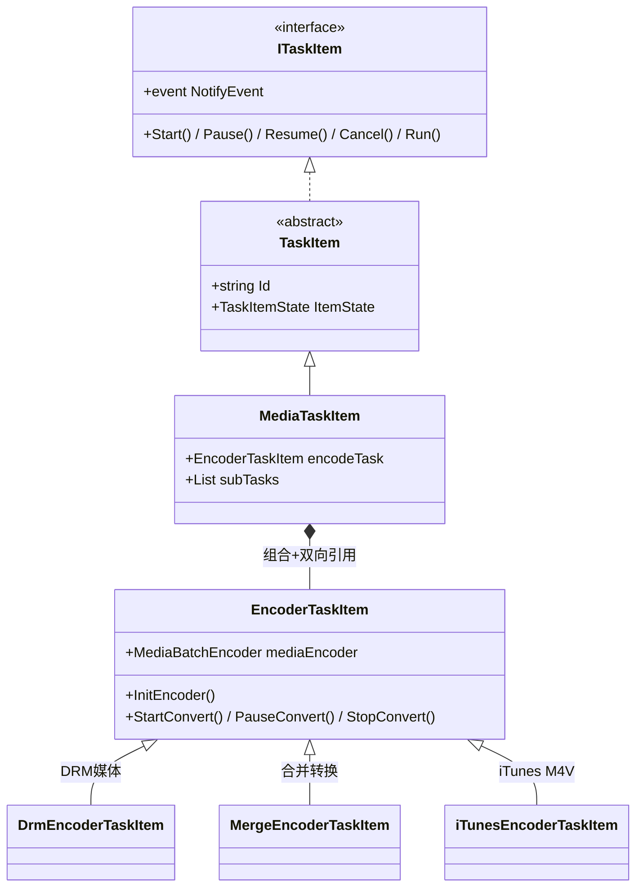
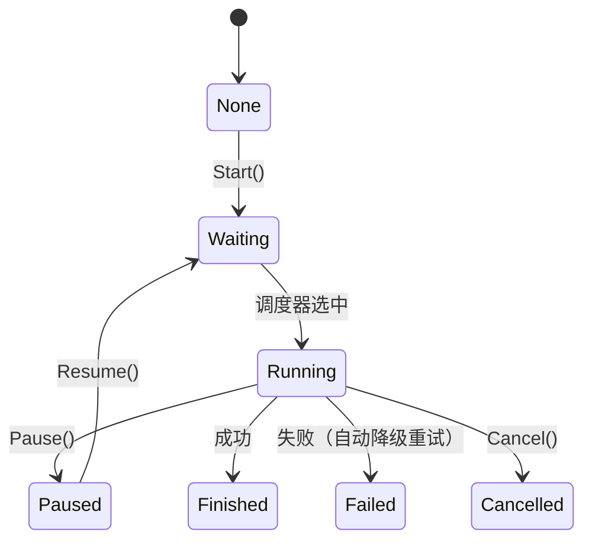
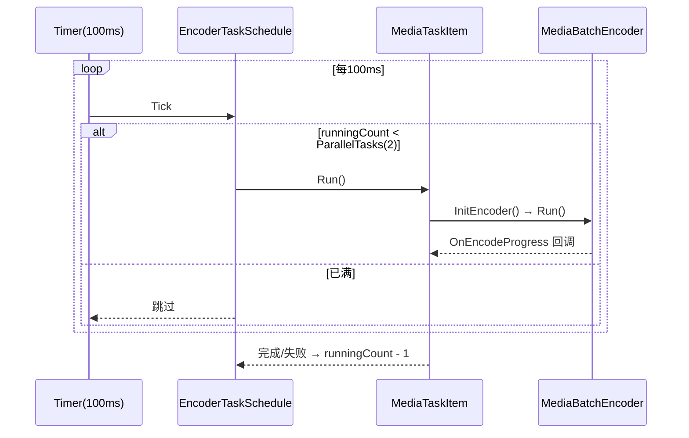

我设计了一个TaskManager 任务调度模块设计方案，你帮我看下哪里设计不合理，哪里可以优化

# TaskManager 任务调度模块设计

TaskManager 模块采用 接口 → 抽象基类 → 具体实现 → 专用变体 的四层继承架构。

## 类结构



## 任务状态机



## 调度执行时序



## 并发约束

| 约束项 | 值 |
|---|---|
| 最大并行任务 | 2 |
| 调度轮询间隔 | 100ms |

## 并发保护机制

| 保护对象 | 机制 | 说明 |
|---|---|---|
| `runningTasksCount` | `lock(runningTaskCountObj)` | 后台转码线程回调写入，需要锁 |
| `drmRuningTaskCount` | `lock(drmRuningtaskCountObj)` | 静态字段跨实例共享，需要锁 |
| 调度逻辑 `ExceuteTask()` | WinForms Timer（UI 线程串行） | Tick 天然互斥，无需额外加锁 |

## 关键设计模式

| 模式 | 应用点 |
|---|---|
| **模板方法** | `TaskItem` 定义 Start/Run 等骨架，子类覆写具体行为 |
| **策略模式** | `EncoderTaskItem` 三个子类分别处理 DRM、合并、iTunes |
| **观察者模式** | `OnEncodeProgress` 事件链从引擎逐层传递到 UI |
| **状态模式** | `TaskItemState` 枚举驱动行为（Waiting 才进队列等调度） |

### 各模式代码体现

**模板方法**（`TaskItem` → `MediaTaskItem`）

```csharp
// 基类定义骨架
public virtual void Start()  { ItemState = TaskItemState.Running; }
public virtual void Run()    { /* 子类实现 */ }

// 子类覆写
// MediaTaskItem.Start() 设为 Waiting，由调度器异步触发 Run()
public override void Start() { ItemState = TaskItemState.Waiting; }
public override void Run()   { encodeTask.StartConvert(); }
```

**策略模式**（`EncoderTaskItem` 变体）

```
EncoderTaskItem         ← 基类（默认 ffmpeg 转码）
  ├─ DrmEncoderTaskItem      ← DRM 解密 + 外部解码器
  ├─ MergeEncoderTaskItem    ← 多文件进度聚合
  └─ iTunesEncoderTaskItem   ← 启动 iTunesConverter.exe 进程通信
```

**观察者模式**（进度回调链）

```
MediaBatchEncoder.OnEncodeProgress
  → EncoderTaskItem.mediaEncoder_OnEncodeProgress()
      → MediaTaskItem 更新进度字段
          → TaskItem.ItemStateChanged() 触发 NotifyEvent
              → UI 层刷新进度条
```

## MediaTaskItem 与 EncoderTaskItem 的关系

两者是**组合（Composition）+ 双向引用**的关系：

```
MediaTaskItem  ──── 持有 ────►  EncoderTaskItem
   （逻辑主体）                    （执行载体）
                ◄── mediaBaseTask ──
```

- `MediaTaskItem`：任务的**逻辑主体**，负责状态管理、参数维护、UI 通知
- `EncoderTaskItem`：转码的**执行载体**，负责驱动底层 `MediaBatchEncoder`

### 创建时机

`EncoderTaskItem` 在 `MediaTaskItem` 构造时**按媒体类型动态选择**子类：

```csharp
if (MediaSource.SrcISDRMMediaType)
{
    if (mediaInfo.Format.ToUpper() == "M4V")
        encodeTask = new iTunesEncoderTaskItem(taskSchedule, this); // iTunes M4V
    else
        encodeTask = new DrmEncoderTaskItem(taskSchedule, this);    // DRM 媒体
}
else
    encodeTask = new EncoderTaskItem(taskSchedule, this);           // 普通转码
```

`this` 传入构造函数，形成反向引用 `mediaBaseTask`，本质是**工厂方法 + 策略模式**。

### 调用方向

| 方向 | 调用时机 | 方法 |
|---|---|---|
| `MediaTaskItem` → `EncoderTaskItem` | 调度器触发 `Run()` | `encodeTask.StartConvert()` |
| `MediaTaskItem` → `EncoderTaskItem` | 用户暂停 | `encodeTask.PauseConvert()` |
| `MediaTaskItem` → `EncoderTaskItem` | 用户取消 | `encodeTask.StopConvert()` |
| `EncoderTaskItem` → `MediaTaskItem` | 转码进度更新 | `MediaTask.OnEncodeProgress(...)` |
| `EncoderTaskItem` → `MediaTaskItem` | 读取编码参数 | `mediaBaseTask.FormatParamEditMrg` |
