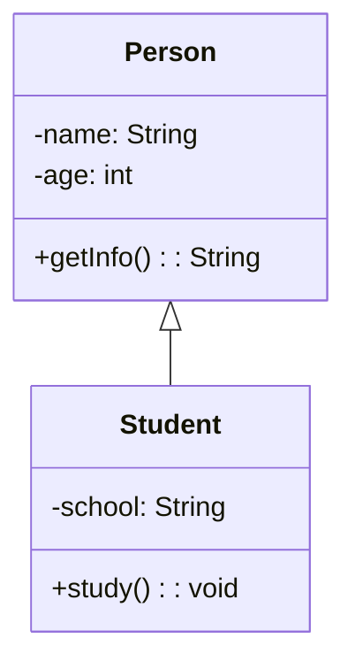

## 使用 PlantUML

### WIN 环境准备

1. 安装java（PlantUML 运行依赖）

   - https://www.oracle.com/java/technologies/downloads/
   - 系统环境变量新增
      - JAVA_HOME为jdk安装的目录
      - CLASSPATH为`.;%JAVA_HOME%\lib;%JAVA_HOME%\lib\tools.jar`

   - 系统环境path变量编辑新增
     - `%JAVA_HOME%\bin;%JAVA_HOME%\jre\bin`

2. 安装 GraphViz（用于渲染图形）

   - https://plantuml.com/zh/starting

### MAC 环境准备

1. 安装 Java

   PlantUML 需要 Java 运行环境支持，建议使用 JDK 8 或更高版本。

   - 使用 Homebrew 安装：

     ```
     brew install openjdk
     ```

   - 设置 JAVA_HOME

     ```
     echo 'export PATH="/opt/homebrew/opt/openjdk/bin:$PATH"' >> ~/.zprofile
     source ~/.zprofile
     ```

   - 确认安装成功

     ```
     java -version
     ```

2. 安装 Graphviz

   PlantUML 中的类图、时序图等依赖 Graphviz 渲染。

   ```
   brew install graphviz
   # 确认安装成功：
   dot -V
   ```

   

### 安装 VSCode 插件

搜索 `PlantUML`，安装由 **jebbs** 提供的插件


### 创建 UML 文件并预览

1. 新建 `.puml` 文件

   ```
   @startuml
   class Person {
     - name: String
     - age: int
     + getInfo(): String
   }
   
   class Student {
     - school: String
     + study(): void
   }
   
   Person <|-- Student
   @enduml
   ```

2. 预览 UML 图

   命令面板：输入 `PlantUML: Preview Current Diagram` 并回车

3. 导出图片（PNG、SVG、PDF）

   命令面板：输入`PlantUML: Export Current Diagram` 在弹出的格式选择中选择 `png/svg/pdf` 即可导出

## 使用 Markdown 集成 Mermaid
新建 `.md` 文件写入以下代码也可以画 UML 类图：

安装插件 `Markdown Preview Enhanced` 或 `Mermaid Markdown Syntax Highlighting`
使用 VSCode 的 Markdown 预览功能（`Cmd+Shift+V`）即可查看图形

## 使用 Draw.io Integration

1. 搜索并安装插件：`Draw.io Integration`（发布者为 Henning Dieterichs）

2. 在你的项目文件夹下，右键选择 **New File**，命名为：`diagram.drawio.svg` 或 `diagram.drawio.png`

   **推荐使用 SVG 格式**，因为它是可编辑的、可嵌入 Markdown 的矢量图。

3. 使用 Draw.io 图形界面画 UML 图

   你会看到和 https://app.diagrams.net 类似的界面，支持拖拽画图：

4. 保存与导出

   Draw.io 图会自动保存为 `.drawio.svg` 或 `.drawio.png` 文件。

   你也可以：

   - 点击菜单栏中的 `File → Export as → PNG/SVG/PDF` 导出为其他格式

   - 导出的 `.svg` 可以插入到 Markdown 或 Word 文档中

5. Markdown 中嵌入 Draw.io 图

   ```
   
   ```

   VSCode 的 Markdown 预览中可以直接显示这个图。


## Draw.io 与 PlantUML、Mermaid 对比

| 工具         | 类型     | 编辑方式        | 难度 | 推荐使用场景             |
| ------------ | -------- | --------------- | ---- | ------------------------ |
| **PlantUML** | 代码式   | 文本写图        | ⭐⭐⭐⭐ | 自动化生成类图、版本控制 |
| **Mermaid**  | 代码式   | 文本 + Markdown | ⭐⭐⭐  | 文档内轻量嵌入图         |
| **Draw.io**  | 图形界面 | 拖拽编辑        | ⭐⭐   | 手工绘图、视觉表达       |